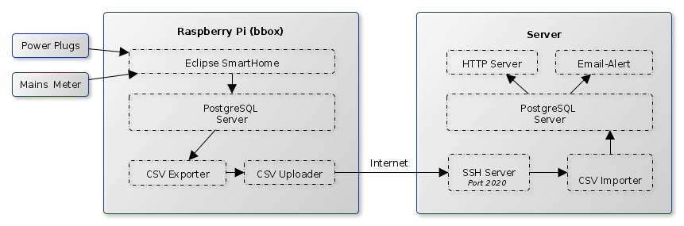
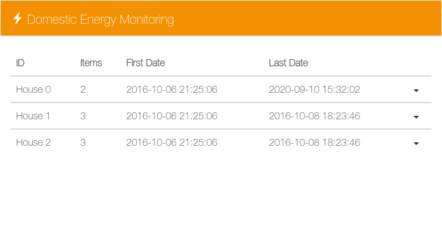
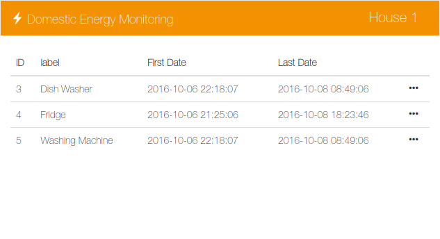
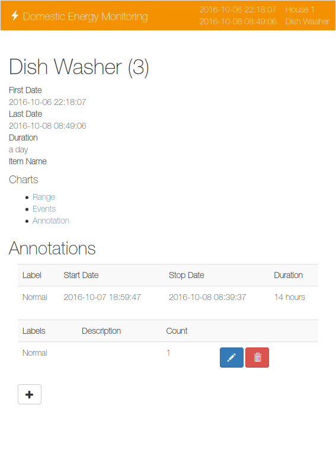
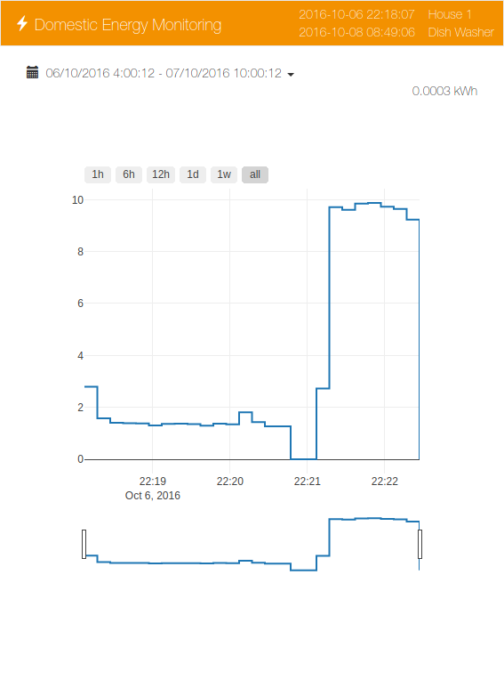
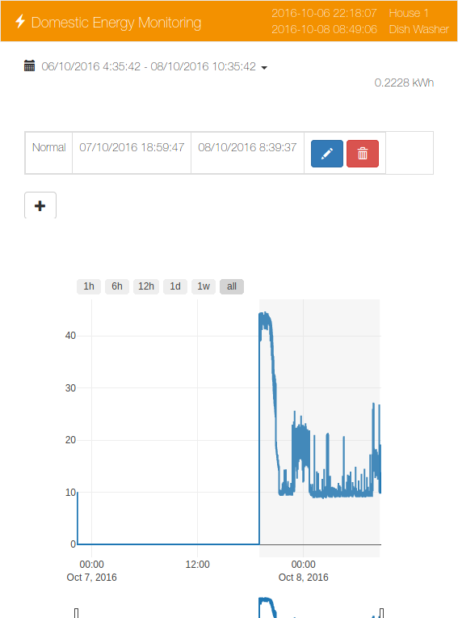

# Energy-Server: Domestic Energy Monitoring System - Server
This is the central server of the distributed domestic energy collection system used to collect the DEDDIAG dataset.

For a general overview  of the Domestic Energy Monitoring System see [deddiag.github.io](https://deddiag.github.io).

The system was tested on [Ubuntu Server](https://ubuntu.com/download/server), but will run on every linux distribution with [Docker](https://www.docker.com/) and [Docker Compose](https://docs.docker.com/compose/) installed.
Instructions how to install Docker on Ubuntu Server:
 * [Docker](https://docs.docker.com/engine/install/ubuntu/)   
 * [Docker Compose](https://docs.docker.com/compose/install/)


The system follows a client-server architecture where each client independently uploads measurements to the server using an encrypted ssh connection.
Client authenticate using public-key authentication.



See [bbox](https://github.com/DEDDIAG/bbox) for client installation.

The energy-server provides a responsive UI that shows an overview of all houses, 
appliances as well as charts and an online annotation tool.

| Houses Overview | Appliances |
| --- | --- |
|||

| House Details | Charts | Annotation Tool |
| --- | --- | --- |
||||


## Installation
1. Clone this repository to a desired location on the server e.g. ```/opt/energy-server``` and change directory into it.
2. The HTTP Server is password protected using [Basic Authentication](https://docs.nginx.com/nginx/admin-guide/security-controls/configuring-http-basic-authentication/)
    Create a ```.htpasswd``` using **one** of the following commands: 
    * ```htpasswd -c .htpasswd user```
    * ```printf user:$(openssl passwd -crypt password)\n > .htpasswd```
3. Create dummy SSL certificates ```docker-compose up certs```
4. Start frontend/nginx ```docker-compose up -d nginx```
5. Create signed certificates ```docker-compose up certs```
6. Reload frontend/nginx ```docker-compose exec nginx nginx -s reload```
7. Start full system ```docker-compose up```
8. Add cronjob in order to import data hourly: sudo crontab -e 
    ```
    10 * * * * root /usr/bin/docker-compose -f /path/to/energy-server/docker-compose.yml exec psql /home/import_csv2db.sh
    ```

## Add Houses
New houses have to be added to ```./volume/home/users.conf``` as ```house-name, public-ssh-key```.
The client keys are shown during the installation process of bbox or can be found in ```/home/pirate/.ssh/id_rsa.pub```

```
house0001, ssh-rsa AAAAB3NzaC1yc2EAAAADAQABAAABgQCoiNITrJidT9bj8H3KmpmKdHKLVvkOCoYEb5yaq42dhMJBF4n7WrDFeQiiMSsFtFYl0cjdDi3HVutglD8FDe4RkADHAfPl9qcv4F9IEzHg6CxIyuZgk/3owZZGX5IZ6/CW6EGsqR1HtuigGVEJtImPiODpKypuyZ0ZNerXI3Fw2lGtica808nO9pKRVoCDqRqwLeOEJgh9pDd1+OMJuAtwsBj+5wWp3CdSys9HQOS24LRJe1W+FP1L/7iCDppOHIlUIb3y3WniJGAFb6a1kHTl7xCoyNtuNZygAvqf6SSSS7sft9k/aFbMGxFfYaeM2jyjNqICHH7VA8S6teVZJoHmErQCBeDubBuBqBTjOI/kKVN9NbN2oT/8XVnMRMwGNXGWptLD8mWBTILK/KQZNw2FAVi/TxdKAKbXtl2stiyK+ZSzC2IJpxvNiAJqEKdMgxp4sTzkR0E9if2jznOMtCIEhb1zDvkdVqtFyFJGI078zhdwK0A4dGv0aF4oQ/+W+H8=
house0002, ssh-rsa AAAAB3NzaC1yc2EAAAADAQABAAABgQDvOq3RUgtalLVCtVZ6ZjyxgPLE4GrOWSLkNelF5zP18WwIggOq5eHKy4Q03LNb/CZu7XWLyaG3w15gIGalSG2EZmu2X9Tx8w4XiPUTbcy21yHctyvDoJfBJxLT0B9k+tMVccHhf4gt3EctScPHJxL4CqChYCrnaQV/soEGNljn/JlUn5Zs6pNga025EtxtNbg2c/1Xh0Sp10BCv3+BqBvKArzuw4L4Nd9UtEVYioFRNWd2qTws0+pOW+EwZLrZ90NoYeSBQw+SHem29KjZrZnU+2z7r11LhSJSiJpTom/5ts1sREDEPlomooSfwNlWCY58onP9Qsj1PyZ152/b8ErBtws1lwzyHlb40GNt+bX+QGgB3aIr3Rc3+HPkKTy9kqjbkTG9BuZdlBWnTEm5vBOBroZpMnduMoDoDodNqWgdgppZy1U12CIVe66svxw4EAAwMP6egtSCUUUp8NtKPv+yEm0VAaoCxqLi4hBbO3+uZj6tVydn/U/0XSwgr9jw0/E=

```
**IMPORTANT**: Keep a blank line at the end of the file.

## Run
```docker-compose up```

You may access the UI using ```https://<SERVER-IP>```.

## Citation
When using the system in academic work please cite [this paper](https://doi.org/10.1038/s41597-021-00963-2) as the reference.
```
@article{DEDDIAG_2021,
  author = {Marc Wenninger and Andreas Maier and Jochen Schmidt},
  title = {{DEDDIAG}, a domestic electricity demand dataset of individual appliances in Germany},
  year = {2021},
  month = jul,
  volume = {8},
  number = {1},
  journal = {Scientific Data},
  doi = {https://doi.org/10.1038/s41597-021-00963-2},
  url = {https://rdcu.be/coGqL},
}
```

## Acknowledgements
The monitoring system and dataset were created as part of a research project of the [Technical University of Applied Sciences Rosenheim](https://www.th-rosenheim.de/).

The project was funded by the [German Federal Ministry of Education and Research (BMBF)](https://www.bmbf.de/), grant 01LY1506,
and supported by the [Bayerische Wissenschaftsforum (BayWISS)](https://www.baywiss.de/).


## License
This software is MIT licensed, as found in the [LICENSE](./LICENSE) file.
